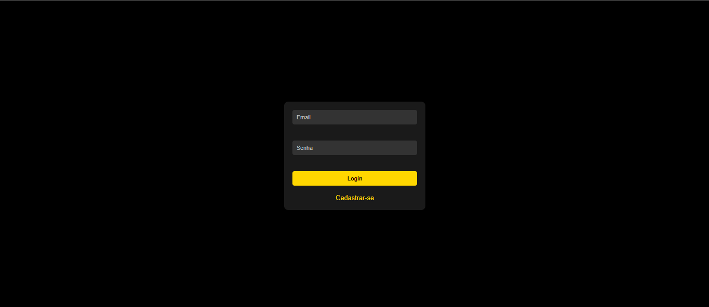
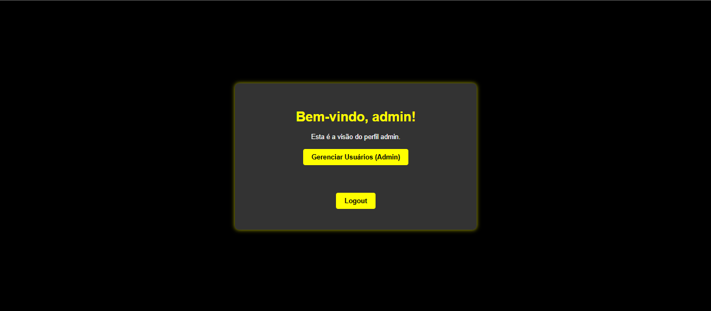

 ## 🚀 CadLog_System
# 🌟 Descrição do Projeto
O CadLog_System é uma solução robusta para cadastro e login de usuários, projetada para atender a diferentes necessidades organizacionais. Com três tipos de perfis de acesso, o sistema garante controle e segurança:  

# 👨‍💼 Admin
Controle total do sistema.  
Permissões para gerenciar usuários, configurações e dados.  
# 📊 Gestor
Acesso intermediário.  
Permissão para gerenciar dados e equipes.  
# 👥 Colaborador
Acesso limitado.  
Capacidade de visualizar e interagir com áreas específicas da aplicação.  
Desenvolvido com foco em usabilidade e acessibilidade, o sistema apresenta uma interface moderna e responsiva, com um design que se adapta a diversos dispositivos, proporcionando uma experiência visual agradável.  

# ⚙️ Funcionalidades Principais
Login de Usuário: Autenticação simples e segura com email e senha. 🔑  
Cadastro de Usuário: Registro de novos usuários com atribuição automática de perfis. 📝  
Validação de Formulários: Checagem automática de campos obrigatórios, padrões de email e regras de senha. ✔️  
Estilização Responsiva: Layout adaptável a diferentes tamanhos de tela, otimizando a experiência em desktops e dispositivos móveis. 📱💻  
Degradê e Animações CSS: Fundo das páginas com cores e botões que reagem ao movimento do mouse com efeitos de crescimento e mudança de cor. ✨  

# 🖼️ Telas

# 🛠️ Tecnologias Utilizadas
GitHub: Controle de versão e colaboração no código. 🐙  
XAMPP: Plataforma para desenvolvimento local. 🖥️  
PhpMyAdmin: Gerenciamento de banco de dados MySQL. 🗄️  
PHP: Backend para a lógica de autenticação e gerenciamento. ⚡  
CSS: Estilização das páginas com foco em acessibilidade e animações. 🎨  
HTML: Estruturação semântica das páginas. 🏗️  
 

